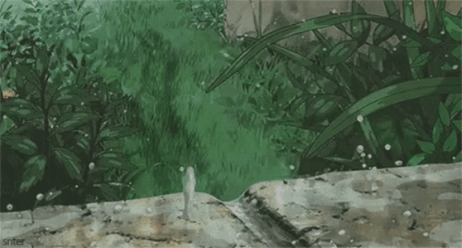

  

 

<h1 align="center">Hi 👋, I'm Sudipta Naiya</h1>

<h2 align="center">Know About Me</h2>

<table border="0">
<tr>
<td width="35%" align="center">

</td>

<td width="65%">

<h3>Hey there! I'm Sudipto</h3>

I'm a developer who enjoys turning ideas into practical projects and
learning new technologies along the way.

 I enjoy building projects and experimenting with code. 
 Currently learning DSA, Web Development and new technologies. 
 Interested in Python, Java and software development. 
 My goal is to keep learning and build useful things.

</td>
</tr>
</table>

Welcome to my GitHub Profile 🚀

---

<h2 align="center">🛠️ Tools & Technologies</h2>

  

 

  

<!-- ================= DEVELOPMENT JOURNEY ================= -->

<h2 align="center">💻 Development Journey</h2>

 

  

 

  

<table border="0">
<tr>

<td valign="top" width="65%">

<h3>✨ Things I Enjoy</h3>

🎮 Gaming is my favorite way to escape from debugging for a while.

🎧 Music is basically part of my development environment.

🧠 I enjoy random questions that turn into hours of exploring and learning.

💡 I like taking things apart, understanding how they work, and occasionally making them better.

</td>

<td valign="middle" width="35%" align="center">

</td>

</tr>
</table>
